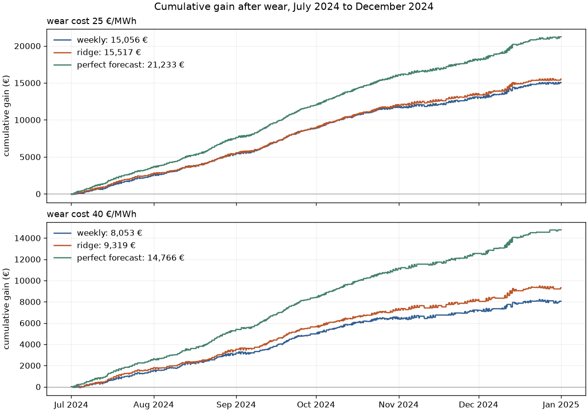
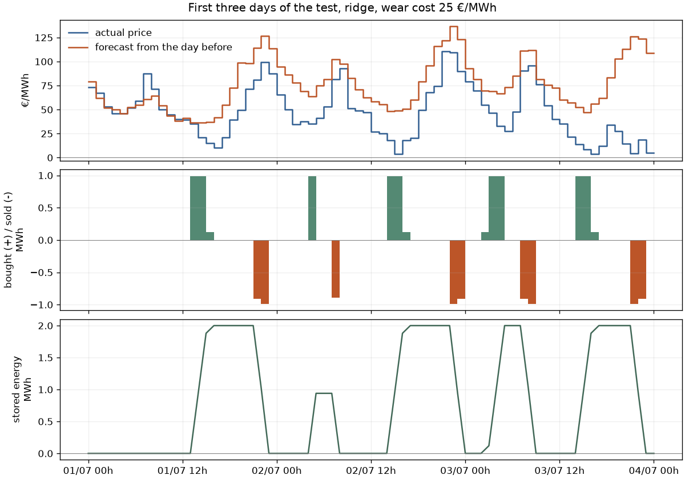

# bess-arbitrage

A small project to see how useful price forecasts can be on a "big" market. A simulated battery (2 MWh, 1 MW) buys electricity on the French day-ahead market when it is cheap and sells it when it is expensive, and I check if a better forecast actually makes it more profitable.

The orders for a day are sent the day before, so the real prices are not known yet. Every day I forecast the next two days, compute the best plan for these forecasts with dynamic programming, and only keep the orders for the first day. Then the gains are computed with the real prices.

Two forecasts:
- weekly, the price at the same hour a week before
- ridge, a linear regression on the prices of the last two days, the price a week before, the hour and the day of the week

I also run a "perfect forecast" where the battery knows every price in advance. You cannot do that for real, but it gives an upper bound.

# Results

Ridge was trained on 2022-2023 and never retrained. January-June 2024 was for the last choices, July-December 2024 was the final test, and I added January-June 2025 at the very end as a second check.

Gains in euros over six months, after wear (wear is a cost per MWh taken out of the battery, [method.md](method.md) explains where 25 and 40 €/MWh come from):

| Period | Wear | Weekly | Ridge | Perfect forecast |
|---|---:|---:|---:|---:|
| Jul-Dec 2024 | 25 €/MWh | 15,056 | 15,517 | 21,233 |
| Jul-Dec 2024 | 40 €/MWh | 8,053 | 9,319 | 14,766 |
| Jan-Jun 2025 | 25 €/MWh | 15,533 | 16,933 | 23,563 |
| Jan-Jun 2025 | 40 €/MWh | 7,370 | 10,181 | 16,879 |

`python main.py` prints these, plus the forecast errors and the January-June 2024 results.



Ridge wins every time, but with cheap wear it is only by a few percent (3% on the test, 9% on 2025). With 40 €/MWh the gap is bigger (16% and 38%), I think because a bad cycle costs more there. Both are still far from the perfect forecast.

I also tried giving the past prices different weights on weekends. On January-June 2024 the forecast got better, 18.9 instead of 22.0 €/MWh of MAE, but the battery was less profitable with it (6,202 € instead of 6,386 € with a wear of 25 €/MWh). I did not expect that. My guess is that it trades a bit more at hours where being right does not matter much, and the MAE counts every hour the same. I kept the plain ridge.

The first three days of the test:



There is no investment cost, grid fees or financing in any of this, and every order is assumed to be accepted at the market price, so do not read the gains as what a real battery would make. Two test periods of six months is not a lot either.

Other things I tried and dropped: one ridge per hour, retraining every month, RTE consumption forecasts, boosted trees, small neural nets, a more cautious version based on past forecast errors. Some of them did better on 2023, but I had used 2023 so much by then that I did not really trust it.

The idea I would look at again is training the model on the decisions instead of the price error (SPO+, and the same idea with neural nets). It was the best on 2023, about 12% more than ridge with a wear of 25 €/MWh, but 2023 is the year I used for everything, so I cannot really say it is better.

Apart from the clock changes, which were a real pain to deal with, it was an interesting project and I learned a lot about the French and European electricity markets. I am still new to the field, so I probably did not split my time very well between the main model and side explorations, some of them more useful than others. I think the next big thing to look at is the day-ahead market with 15-minute prices (since October 2025), and maybe the intraday market.

# Running it

```bash
pip install -r requirements.txt
python main.py
```

It takes about 20 seconds and saves the figures in `figures/`. The tests run with `python -m unittest tests`.

- [battery.py](battery.py): the battery (stored energy, cash, wear)
- [dispatch.py](dispatch.py): dynamic programming when the prices are known
- [forecast.py](forecast.py): weekly forecast, ridge, choice of alpha
- [backtest.py](backtest.py): the day by day simulation
- [main.py](main.py): runs everything
- [download.py](download.py): downloads the prices again (they are already in `data/`)
- [method.md](method.md): equations and details

Prices from Bundesnetzagentur | SMARD.de, via [Energy-Charts](https://energy-charts.info) (Fraunhofer ISE), CC BY 4.0.
